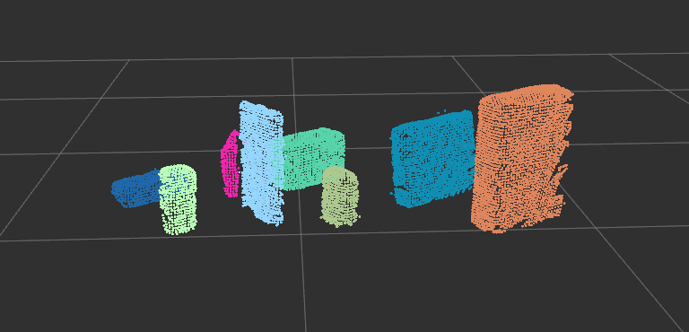

# Robotics Nanodegree Perception Project Writeup

## Exercise 1, 2, and 3 pipeline implementation

### Exerciese 1: Filter PCL data

I first converted the ROS message to PCL data. I then applied a statistical outlier filter to remove noice from the PCL data.

**Figure:** Raw PCL data.               | **Figure:** Filtered PCL data.
:--------------------------------------:|:-----------------------------------:
  |

I used 5 as the outlier filter's mean k value and an standard deviation multiplier for the distance threshold as 0.5.

I then downsampled my data using a voxel grid filter with a LEAF_SIZE of 0.005 which reduced the complexity just enough without
removing a lot of detail from the point cloud.

Next, I applied couple of pass throught filters to remove all elements except the table and the objects. The first pass through
filter was along the Z axis, to remove the stand for the table. I then applied a second filter along the X axis to remove the
edges of the boxes.

I then applied a RANSAC filter on this data to separate the table and the objects. I used a distance threshold of 0.01 for the
filter.

**Figure:** RANSAC filtered table.      | **Figure:** RANSAC filtered objects.
:--------------------------------------:|:-----------------------------------:
       |

### Exercise 2: Clustering

Next, I applied Euclidean clustering to separate the clusters. I used a cluster tolerance of 0.03, minimum cluster size of 50
and max cluster size of 3000. Using these values yielded the best results for me.

**Figure:** Clustered objects.

Next, I converted the necessary point cloud data to ROS cloud objects and published them.

### Exercise 3: Object recognition

I updated both the `compute_color_histograms()` and `compute_normal_histograms()` functions. I computed the histograms using
16 bins. I tried multiple bin sizes, 32, 64 and 128, but I did not see a lot of improvement in classification. Also, using a
lowe bin size helped reduce the capture time of the modes. I used a range of `(0, 255)` for the color histograms and a range
of `(-1, 1)` for the normals. I used HSV for the color hostograms. I then normalized the histograms.

I trained [several SVMs](https://github.com/sbagadi/RoboND-Perception-Project/tree/master/pr2_robot/scripts/svms) using
varius bin sizes mentioned above. I initially only captured small number of samples (between 10- 20) for each model, but the
results were pretty bad. This approch acutually worked for the first world whth only 3 models. But as the number of models
increased in world 2 and 3, I was seeing worse results. I then used a much higher number of samples of 500, but this was
still not giving me satisfactory results. I was classifying the required number of objects to complete the challenge, but I
wanted to classify all the objects.

When training the obtained data, I tried sevearal ways to determine the right hyper parameters (`gamma` and `c` for
the sigmoid and rbf functions). I applied a technique I learned in this [RBF SVM prarameters guide](http://scikit-learn.org/stable/auto_examples/svm/plot_rbf_parameters.html#sphx-glr-auto-examples-svm-plot-rbf-parameters-py)
to find good values for gamma and C. But I was still not getting good results. I think I was overfitting the data. The
following validation is done on features captured with histogram bin size 32 and on 500 samples each for the models.

**Figure:** Validation accuracy for RBF.      | **Figure:** Validation accuracy for Sigmoid.
:--------------------------------------------:|:-----------------------------------:
         |

I reduced the number of bins to 16 (to reduce the capture time) and upped the number of samples to 1000 and started seeing
better results even with a `linear` kernel. I used the seme muber of bins and samples for world 3 and classifed 7/8
objects correctly.

**Figure:** World 1: Confusion matrix with normalization.| **Figure:** World 1: Confusion matrix without normalization.
:-------------------------------------------------------:|:-----------------------------------:
              |

**Figure:** World 2: Confusion matrix with normalization.| **Figure:** World 2: Confusion matrix without normalization.
:-------------------------------------------------------:|:-----------------------------------:
              |

**Figure:** World 3: Confusion matrix with normalization.| **Figure:** World 3: Confusion matrix without normalization.
:-------------------------------------------------------:|:-----------------------------------:
              |

## Pick and place setup

For each of the table tops, I produced the `output_*.yaml` files which are available
[here](https://github.com/sbagadi/RoboND-Perception-Project/tree/master/pr2_robot/scripts). I setup each world and was able
to recognize all the objects in world 1 and 2, but only 7/8 objects in world 3. I think increasing the number of samples
might help recognize the other object as well. The following images show each of the world objects being classified with
their labels.

**Figure:** World 1 classified.

**Figure:** World 2 classified.

**Figure:** World 3 classified.

## Conclusions

An improvement I can make to recognize all the objects in world three could be to increase the number of samples and bins. I
think as the number of models to recognize increase, we need to increase the number of samples captured for each model to
classify all of them better. More data gets better results for the classifer. I was also to get better results with just the
`linear` kernal. Using non-linear (`polynomial`, `RBF` and `sigmoid`) kernels only yielded worse results. I think this is
due to the models trying to overfit the data. This assumption is due to the fact that they are performing really well on
classifying the training data, but failing on the actual data.
